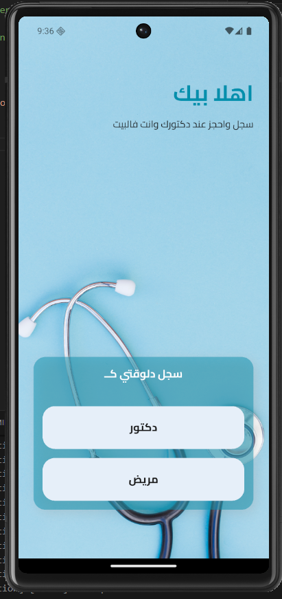
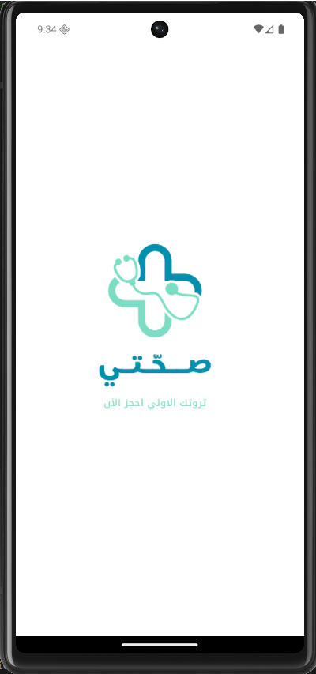
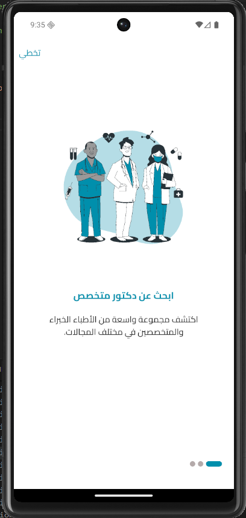
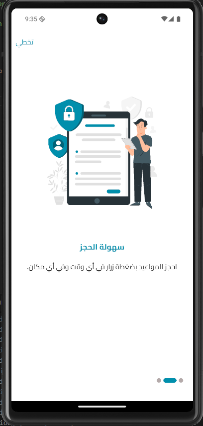
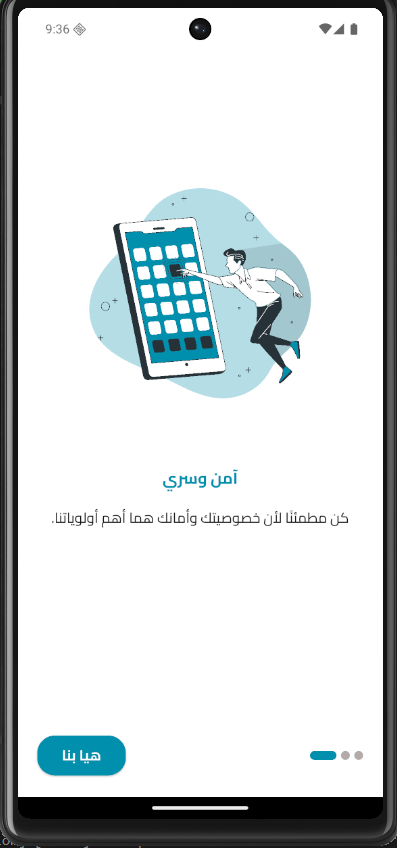
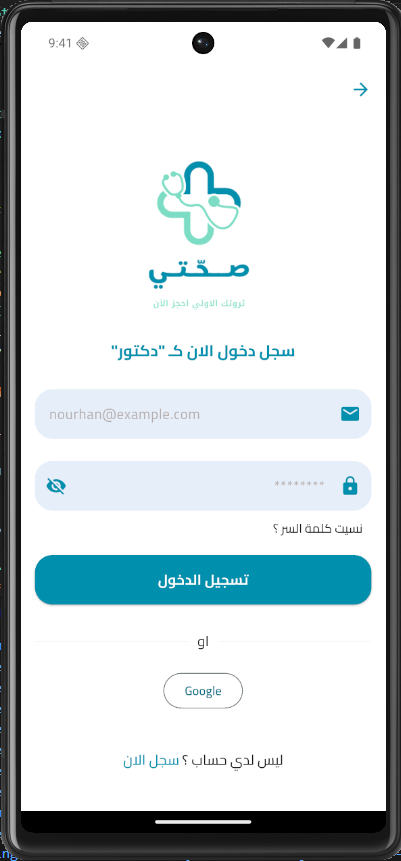
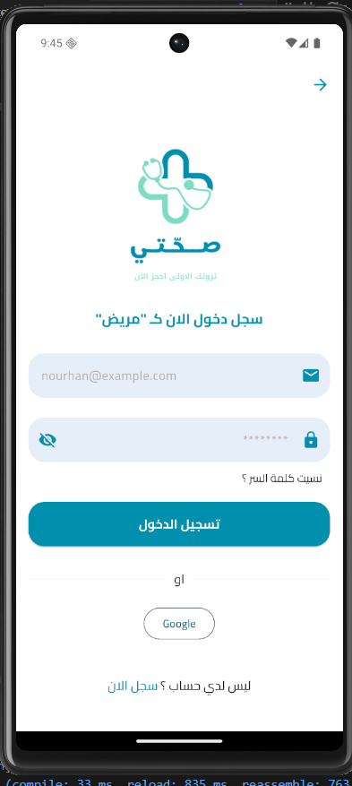
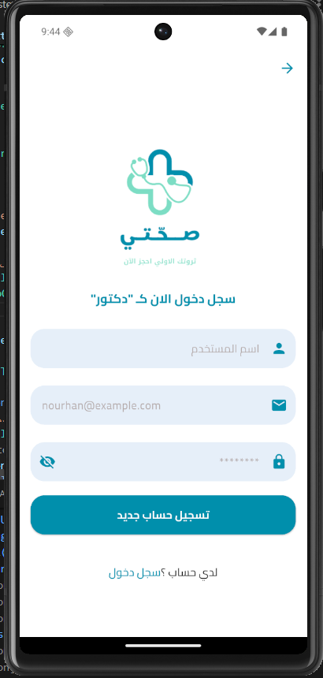
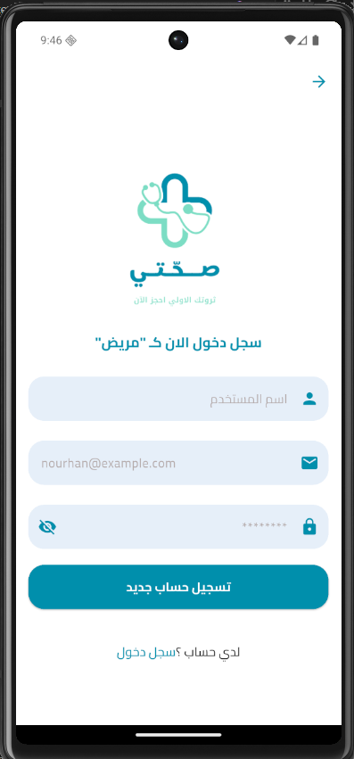

# 📱 s7aty App

<p align="center">
  
  
  
</p>

A modern Flutter mobile application for your Health.

---

## 📸 Screenshots

### ✨ Welcome & Splash

<p align="center">
  
  
</p>

---

### 🚀 Onboarding

<p align="center">
  
  
  
</p>

---

### 🔐 Login & Signup

<p align="center">
  
  
</p>

<p align="center">
  
  
</p>

---

## ✨ Features

* 🔐 Authentication (Login & Signup)
* 🚀 Smooth onboarding experience
* 🌙 Clean and modern UI
* 📱 Responsive design

---

## 🛠️ Tech Stack

* Flutter 💙
* Dart 🚀

---

## 🚀 Getting Started

```bash
flutter pub get
flutter run
```

---

## 👨‍💻 Author

* Nourhan Yaser
