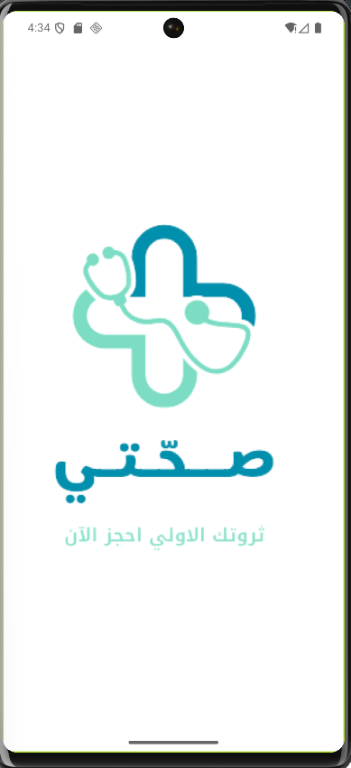
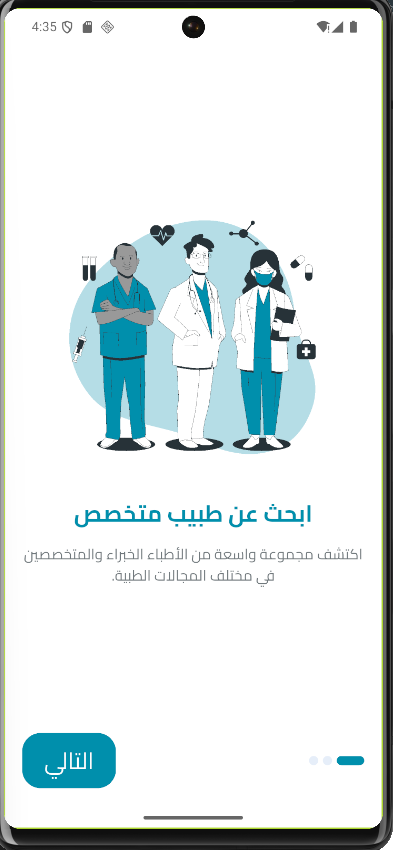
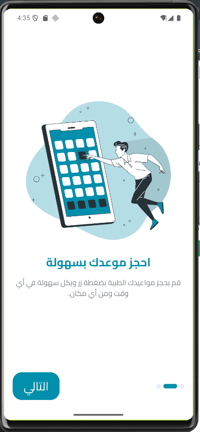
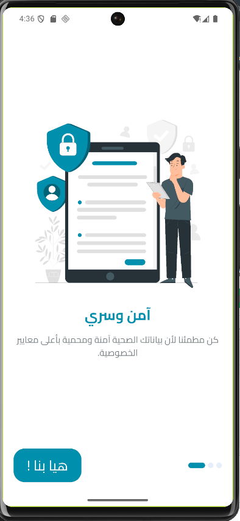
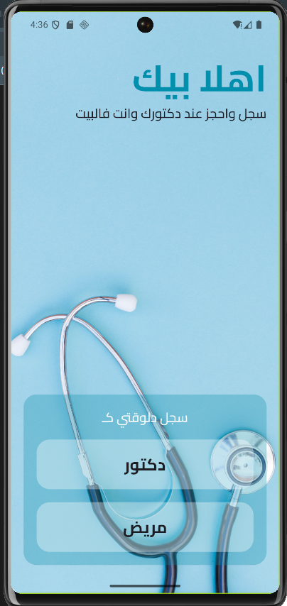
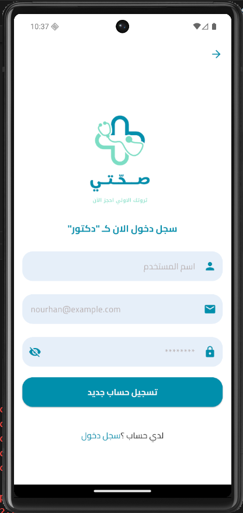
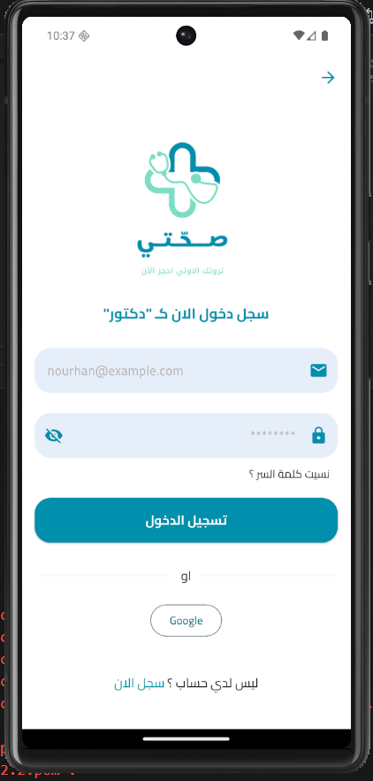
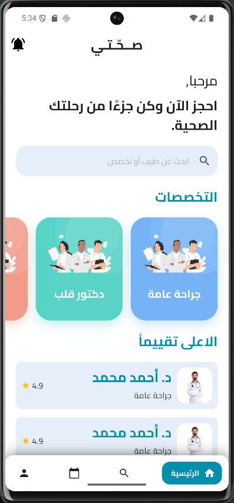
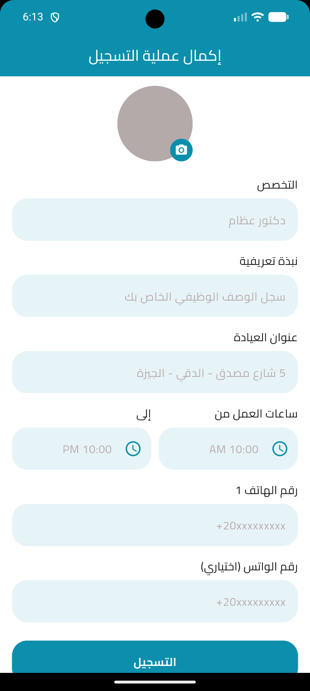

# 📱 s7aty App

<p align="center">
  
  
  
</p>

A modern Flutter mobile application for your Health.

---

## 📸 Screenshots

### ✨ Splash & Onboarding

| Splash Screen | Onboarding 1 | Onboarding 2 | Onboarding 3 |
|---|---|---|---|
|  |  |  |  |

---

### 🔐 Auth Screens

| Welcome | Register | Login |
|---|---|---|
|  |  |  |

---

### 🏠 Home Screen

| Patient Home | Update profile |
|---|---|
|  | |

---

## ✨ Features

* 🔐 Authentication (Login & Signup)
* 🚀 Smooth onboarding experience
* 🌙 Clean and modern UI
* 📱 Responsive design

---

## 🛠️ Tech Stack

* Flutter 💙  
* Dart 🚀  
* Firebase 🔥  

---

## 🚀 Getting Started

```bash
flutter pub get
flutter run
